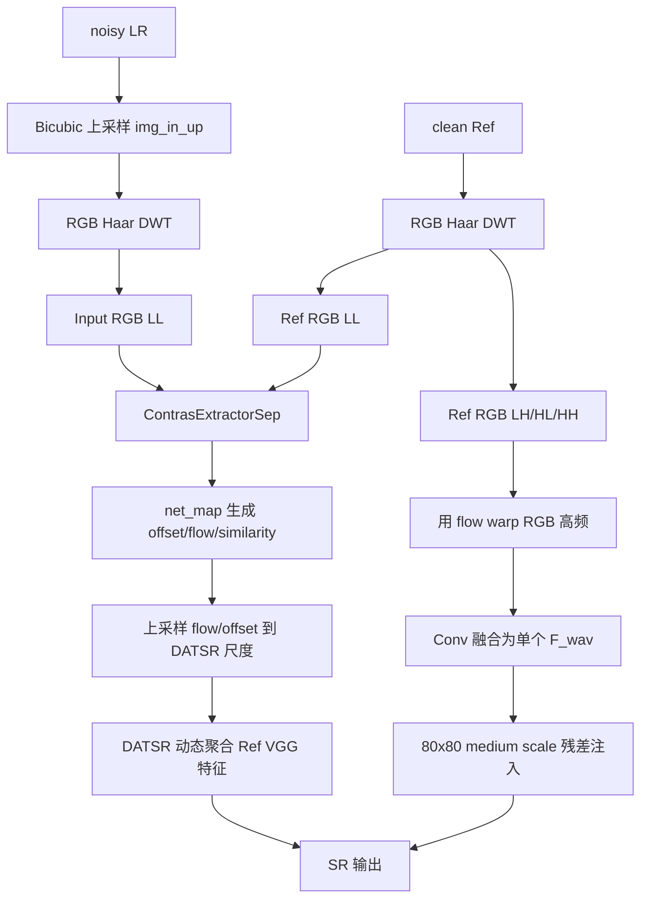
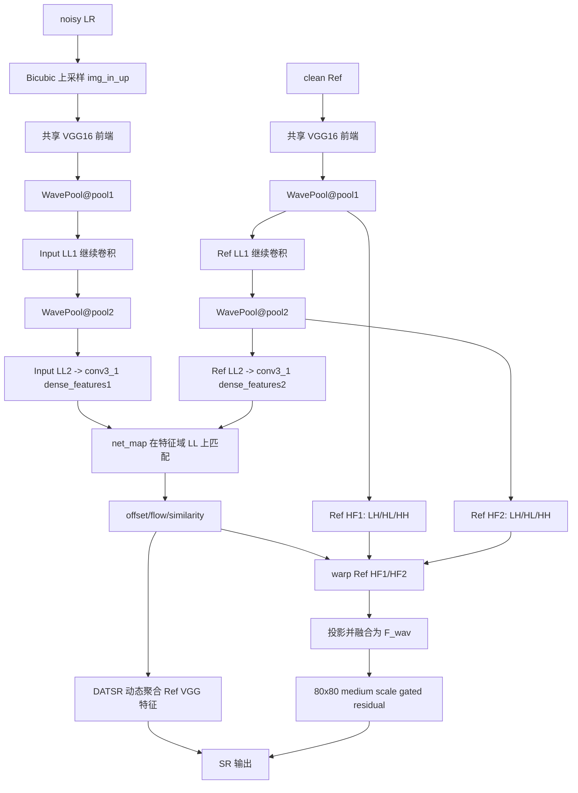

# DATSR 小波改进项目记录

本文档用于记录 DATSR 小波改进项目的当前理解、历史方案、实验结果、问题分析和后续实验路线。所有内容按中文整理，便于后续论文复现、服务器同步、汇报 PPT 和阶段总结使用。

## 1. 项目定位

### 1.1 研究任务

本项目基于 DATSR 原项目，研究 Reference-based Image Super-Resolution，即参考图像超分辨率。

当前重点不是普通干净 CUFED，而是带噪声输入的 RefSR 场景：输入图像加入高斯噪声，主要实验设置为 CUFED / CUFED5 上的 `sigma=50` 高斯噪声。目标是利用 noisy LR 输入和 clean Ref 参考图恢复 clean HR 输出。

### 1.2 当前数据流

当前 noisy 数据集类为 `NoisyRefCUFEDDataset`，核心返回项如下。

| 字段 | 含义 | 作用 |
|---|---|---|
| `dataroot_in` | 带噪声输入图像路径 | 作为 noisy 输入来源 |
| `dataroot_gt` | 干净 GT 图像路径 | 作为监督目标 |
| `dataroot_ref` | 干净参考图路径 | 作为 RefSR 参考图 |
| `img_in_lq` | noisy LR | 输入恢复主干 |
| `img_in_up` | noisy LR bicubic 上采样图 | 用于匹配或小波低频匹配 |
| `img_ref` | clean Ref | 提供参考纹理 |
| `img_in` | clean GT | 训练监督目标 |

训练目标可以概括为：

```text
noisy LR + clean Ref -> clean HR
```

### 1.3 当前主干结构

当前主要使用 `RefRestorationModel`，核心模块如下。

| 模块 | 作用 |
|---|---|
| `net_extractor` | 提取输入图和参考图的匹配特征 |
| `net_map` | 根据匹配特征生成 `pre_offset`、`pre_flow`、`pre_similarity` |
| `net_g` | DATSR / Swin U-Net 风格恢复主干，使用参考特征和 offset/similarity 做动态聚合 |
| `net_wavelet` | 后续新增的小波分支，用于低频匹配或高频迁移 |

核心恢复网络主要在 `datsr/models/archs/mul_swin_unetv3_ref_restoration_arch.py` 中。`NewSwinUnetv3RestorationNet` 先提取 LR 内容特征，再进入 `DynamicAggregationRestoration`，在 `relu1_1 / relu2_1 / relu3_1` 多尺度参考特征上做动态聚合。

## 2. 本地与远端状态

项目远端仓库：

- `https://github.com/pmy12138/DATSR_new.git`

之前检查时的版本状态：

| 项目 | 版本 |
|---|---|
| 本地 HEAD | `b022cb49cbffb00cf5cf0289f10dd23fdbd0af3d` |
| 远端 `origin/main` | `a67c55e84558582d28c6106855eddf2331ac3604` |

当时判断：本地和 GitHub main 不完全一致。远端 main 多了 `README.md`，本地工作区里 `README.md` 处于 staged add 状态。本地还存在 `.idea/`、`AGENTS.md`、`datasets/`、`experiments/`、`tb_logger/`、`add_noisy.py`、`test_noisy_metrics.py` 等实验和辅助内容。

注意：本地大量数据、实验输出和辅助脚本不一定属于远端 tracked 核心代码，同步服务器时应优先同步模型代码、配置文件和必要工具脚本。

## 3. 已有方案分类

### 3.1 总览表

| 类别 | 代表方案 | 核心思路 | 主要问题 |
|---|---|---|---|
| 方案一 | 小波去噪与频域损失 | 输入端小波去噪，输出端增加 `WaveletLoss` / `FFTLoss` | 更偏去噪和频域约束，对参考纹理匹配帮助有限 |
| 方案二 | 并行双分支小波结构 | DATSR 空间分支 + 小波频率分支并行 | 高频注入依赖 gate 和 scale，容易贡献过弱或引入错纹理 |
| 方案三 | RGB 小波 LL 匹配，方案 B | RGB 图像域 Haar DWT，使用 LL 子带匹配 | 仍是 RGB 小波域，与 WTRN 特征域 LL 匹配不一致 |
| 方案四 | RGB Ref 高频残差迁移，方案 C/D | 用 LL 匹配得到的 flow warp RGB 高频，再注入 `F_wav` | 高频被压成单个 `F_wav`，只在 80x80 注入，表达和对齐都有限 |
| 方案五 | WTRN-style 特征域小波分支 | VGG 特征域 WavePool，LL 匹配，Ref 特征高频迁移 | 当前是 DATSR 过渡版，不是完整 WTRN；训练后出现明显退化，需要诊断 |

### 3.2 方案一：小波去噪与频域损失

相关文件：

- `datsr/models/wavelet_ref_restoration_model.py`
- `datsr/models/archs/wavelet_utils_arch.py`
- `datsr/models/losses.py`

主要思路：

- 使用 `WaveletDenoiseModule` 对输入进行小波域去噪。
- 将图像分解为 LL、LH、HL、HH。
- 对高频子带使用 mask 机制抑制噪声。
- 增加 `WaveletLoss` 和 `FFTLoss` 等频域监督。

判断：该方案更偏输入端去噪和输出端频域约束，对 RefSR 中“参考纹理如何可靠匹配和迁移”的帮助有限。如果仍然主要依赖 L1，输出容易偏平滑。

### 3.3 方案二：并行双分支小波结构

相关文件：

- `datsr/models/wavelet_parallel_restoration_model.py`
- `datsr/models/archs/parallel_dual_branch_arch.py`
- `options/train/train_parallel_dual_branch*.yml`

主要思路：

- 保留 DATSR 空间分支。
- 新增小波频率分支。
- 频率分支处理输入和参考的高频信息。
- 使用 similarity gate、zero-init residual fusion、reference HF confidence 等机制控制高频注入强度。

判断：该方案更像在 DATSR 主干外并联一个频率补偿分支。训练早期比较安全，但高频贡献可能很小；如果参考匹配不稳定，高频分支也可能带来错误纹理和人脸扭曲。

### 3.4 方案三：RGB 小波 LL 匹配，方案 B

相关文件：

- `datsr/models/archs/wavelet_branch_arch.py`
- `datsr/models/ref_restoration_model.py`
- `options/train/train_datsr_wavelet_ll_matching_noisy.yml`

主要思路：

- 对 `img_in_up` 和 `img_ref` 做 RGB 图像域 Haar DWT。
- 使用 LL 子带进行匹配，假设 LL 更稳定、更抗噪。
- 在 LL 分辨率上得到 offset/flow/similarity。
- 再将 offset/flow/similarity 上采样回 DATSR 主干需要的尺度。

判断：该方案比直接 noisy 图像匹配更合理，但仍是 RGB 图像域小波。它没有进入 WTRN 强调的 VGG 特征域小波匹配，因此抗噪性和语义稳定性有限。

### 3.5 方案四：RGB Ref 高频残差迁移，方案 C/D

相关文件：

- `datsr/models/ref_restoration_model.py`
- `datsr/models/archs/mul_swin_unetv3_ref_restoration_arch.py`
- `options/train/train_datsr_wavelet_ref_hf_noisy.yml`
- `options/train/train_datsr_wavelet_ref_hf_cplus_noisy.yml`
- `options/train/train_datsr_wavelet_ref_hf_gate_noisy.yml`

主要思路：

- 使用 LL 匹配得到的 flow warp Ref 的 RGB 高频子带。
- 将 Ref 高频融合为 `F_wav`。
- 在 DATSR medium scale，即 80x80 特征处注入 `F_wav`。
- 包含 zero-init、bounded scale、similarity gate 等控制策略。

判断：该方案只把 RGB 高频压缩成单个 `F_wav`，没有保留 WTRN 中多层、多方向 LH/HL/HH 的结构。`max_ref_hf_scale=0.05` 时高频贡献被限制得较小，提升可能不明显；如果 flow 或 similarity 不准确，高频迁移容易造成脸部纹理错位。

## 4. WTRN 理解与当前接入

参考项目：

- `https://github.com/zskuang58/WTRN-TIP`

WTRN 的关键点不是直接在 RGB 图像上做小波，而是在 LTE/VGG 特征提取器内部使用 WavePool 替代普通 pooling。WavePool 将特征分为 LL、LH、HL、HH，其中 LL 继续进入后续 VGG 层用于低频匹配，LH/HL/HH 作为特征域高频纹理，被同一个匹配关系迁移到目标位置。

WTRN 对当前项目的启发：

- 低频匹配应尽量来自 VGG 特征域 LL，而不是 RGB LL。
- 高频迁移应尽量保留特征域多层、多方向子带，而不是单一 RGB 高频残差。
- 参考纹理注入需要受 similarity / attention 控制，避免不可信区域强行迁移。
- 只加结构分支还不够，纹理质量通常还需要 perceptual / texture / adversarial 类损失辅助。

### 4.1 改进前流程：RGB 小波 LL 匹配 + RGB 高频残差



### 4.2 改进后流程：WTRN-style 特征域 LL 匹配 + 特征高频迁移



### 4.3 WTRN-style 代码修改表

| 修改位置 | 修改内容 | 参考 WTRN 部分 | 作用 |
|---|---|---|---|
| `datsr/models/archs/wavelet_branch_arch.py` | 新增 `WaveletVGGFeatureExtractor` | WTRN `LTE.py` 中 VGG + WavePool | 在 VGG pool1/pool2 位置做 Haar 分解，LL 继续卷积，LH/HL/HH 保留为高频纹理 |
| `datsr/models/archs/wavelet_branch_arch.py` | 新增 `WaveletVGGFrequencyBranch` | 低频匹配 + 高频迁移 | 输出特征域 LL 匹配特征，并用 flow 迁移 Ref 特征高频 |
| `datsr/models/networks.py` | 新增 `define_net_wavelet()` | 工程接入 | 让配置中的 `network_wavelet.type` 真正生效 |
| `datsr/models/ref_restoration_model.py` | 新增 `use_feature_wavelet_matching` 路径 | 特征域 LL matching | 开启后使用特征域 LL 匹配，并用 `transfer_ref_hf()` 生成 `F_wav` |
| `datsr/models/archs/mul_swin_unetv3_ref_restoration_arch.py` | 接入 `F_wav` gated residual | 参考纹理注入控制 | 在 80x80 medium scale 注入高频残差，并记录 HF stats |
| `options/train/train_datsr_wtrn_feature_wavelet_noisy.yml` | 新增训练配置 | 消融实验入口 | 启用 WTRN-style 特征域小波匹配与迁移 |
| `options/test/test_datsr_wtrn_feature_wavelet_noisy.yml` | 新增测试配置 | 消融实验入口 | 测试 WTRN-style 权重和记录 HF stats |

当前版本不是完整 WTRN 复现，而是把 WTRN 的“特征域小波低频匹配 + 特征高频迁移”思想接入 DATSR 主干，属于过渡版和消融版。

## 5. 实验结果总结

数据来源：`D:\1研究生工作内容\汇报PPT\1-DATSR及改进结果.xlsx`，这里只保留有效对比方案，结果空白或废弃方案不列入。

### 5.1 历史有效方案对比

| 类别 | Excel 编号/方案 | 对应代码或配置 | 改进思路 | 损失 | CUFED5 PSNR/SSIM | CUFED5+σ=50 PSNR/SSIM | 备注 |
|---|---|---|---|---|---:|---:|---|
| 1. 原始参考 | DATSR 论文数据 | 原论文结果 | 论文上界参考 | L1 | 28.72 / 0.856 | - | 只作上界，不与本地 noisy 训练直接等价比较 |
| 1. 原始参考 | DATSR 论文数据 | 原论文结果 | 论文上界参考 | 全部损失 | 27.95 / 0.835 | - | 全部损失更偏感知质量，PSNR/SSIM 不一定更高 |
| 2. Baseline | DATSR 原模型【复现】 | `train_restoration_mse.yml` / `test_restoration_mse.yml` | 不加小波，直接 noisy 数据训练/测试 | L1 | 27.14 / 0.80778 | 26.764 / 0.7841 | 当前最重要 baseline |
| 3. 显式降噪 | 显式降噪 + DATSR | CNN 降噪 + DATSR 串行 | 先显式降噪，再超分 | L1 | - | - | 8spp: 27.066 / 0.75445；16spp: 24.938 / 0.6674 |
| 4. 小波串行 | 小波变换 + DATSR【串行】 | `WaveletRefRestorationModel` | 小波处理后接 DATSR | L1 | 26.349 / 0.7777 | 25.391 或 26.615 / 0.7293 或 0.7835 | 干净 CUFED5 低于 baseline，说明无噪场景存在性能损失 |
| 4. 小波串行 | 小波变换 + DATSR【串行】改进 1 | 修改 `wavelet_forward` 相关流程 | 调整小波前向/串行流程 | L1 | - | 26.683 / 0.78437 | 接近 noisy baseline，SSIM 略好但 PSNR 仍略低 |
| 5. 小波并行 | DMNet 小波部分改进【并行】 | `WaveletParallelRestorationModel` | DATSR 空间分支 + 小波频率分支并行 | L1 | 27.093 / 0.80395 | 25.55 / 0.7354 | noisy 明显退化，说明 σ=50 下并行高频/去噪分支不稳定 |
| 5. 小波匹配迁移 | B: 低频匹配 | `train_datsr_wavelet_ll_matching_noisy.yml` | RGB 小波 LL 上做匹配，不启用 Ref 高频残差 | L1 | - | 26.73 / 0.7871 | SSIM 明显高于 baseline，但 PSNR 没超过 baseline |
| 5. 小波匹配迁移 | C: Ref 高频注入 | `train_datsr_wavelet_ref_hf_noisy.yml` | RGB LL 匹配 + RGB Ref 高频残差注入 | L1 | - | 26.732 / 0.7876 | 相比 B 只有极小提升，高频注入贡献有限 |
| 5. 小波匹配迁移 | D: 注意力门控 | `train_datsr_wavelet_ref_hf_gate_noisy.yml` | 用 similarity gate 抑制不可信高频 | L1 | - | 26.71 / 0.7877 | SSIM 继续微升，但 PSNR 下降，说明 gate 更偏结构保守 |

### 5.2 WTRN-style 训练后结果

训练约 13 小时后测试结果如下。

| 方案 | 测试集 | PSNR | PSNR_Y | SSIM_Y | 判断 |
|---|---|---:|---:|---:|---|
| WTRN-style 特征域小波分支 | CUFED5_sigma50 | 23.504 | 25.260 | 0.7232 | 明显低于 DATSR noisy baseline 和 B/C/D，属于严重退化 |

HF contribution stats 摘要：

| 指标 | 数值 | 含义 |
|---|---:|---|
| `enc_F_wav_abs_mean` / `dec_F_wav_abs_mean` | 0.8437 / 0.8437 | `F_wav` 本身非零，说明高频分支确实参与 |
| `enc_wav_feat_abs_mean` / `dec_wav_feat_abs_mean` | 11.91 / 11.91 | `wav_fusion` 后特征幅值很大，可能对主干造成扰动 |
| `enc_residual_to_h` / `dec_residual_to_h` | 0.1345 / 0.0821 | 高频残差约为主干特征的 8%-13%，不是完全无效 |
| `enc_gate_min` / `dec_gate_min` | -0.1381 / -0.1323 | gate 出现负数，说明 similarity gate 可能使用了未归一化相似度 |
| `enc_ref_hf_scale_abs` / `dec_ref_hf_scale_abs` | 0.033996 / 0.033996 | 高频 scale 学到约 0.034，尚未触顶 0.05 |

结论：这次结果差不是简单说明 WTRN 思想无效，而更像是当前 DATSR 过渡接入方式不稳定。尤其是 `gate_min` 为负，说明当前 `gate = sigmoid_gate * sim_gate` 中的 `sim_gate` 可能不是 `[0,1]` 置信度，而是 raw similarity/logit。负 gate 会导致高频残差反向注入，容易造成模糊、人脸扭曲和 PSNR 明显下降。

### 5.3 为什么 B/C/D 提升不明显

| 原因 | 说明 |
|---|---|
| DATSR baseline 已经较强 | 原主干动态聚合参考特征的能力较强，简单外挂小波分支很难带来大幅提升 |
| RGB 小波域与 VGG/DATSR 特征域存在语义差距 | B/C/D 主要在 RGB 小波域做 LL 匹配和高频迁移，和主干特征空间不完全一致 |
| 高频注入位置较单一 | 高频被融合成单个 `F_wav`，只在 80x80 medium scale 注入，难以精细控制人脸五官等结构 |
| σ=50 噪声降低匹配可信度 | noisy LR 结构被破坏后，错误参考纹理更容易迁移到人脸或边缘区域 |
| gate/scale 必须保守 | 为了避免错纹理，scale/gate 会限制高频贡献，导致提升不明显 |
| L1 损失天然偏平滑 | L1 对错位纹理惩罚很强，网络容易学成保守恢复而不是锐利纹理 |

当前判断：原 DATSR 并非绝对不可改，但在 noisy RefSR 上，小波必须真正改善“匹配可信度”和“高频迁移可信度”。只增加频域分支或单点高频注入，很难稳定超过 baseline。

## 6. 已修复的运行报错

### 6.1 配置参数未被主干接收

报错：

```text
TypeError: __init__() got an unexpected keyword argument 'use_feature_wavelet_matching'
```

原因：配置文件中给 `network_g` 增加了 `use_feature_wavelet_matching`，但 `NewSwinUnetv3RestorationNet.__init__()` 没有接收该参数。

同步服务器需要包含：

- `datsr/models/archs/mul_swin_unetv3_ref_restoration_arch.py`

### 6.2 `WaveletVGGFrequencyBranch` 缺少 `forward`

报错：

```text
NotImplementedError: Module [WaveletVGGFrequencyBranch] is missing the required "forward" function
```

原因：WTRN-style 分支不走普通 `forward()`，而是通过 `extract_matching_features()` 和 `transfer_ref_hf()` 分别完成低频匹配特征提取和高频迁移。之前 `_wavelet_forward()` 在某些路径下仍然直接调用了 `self.net_wavelet(...)`。

同步服务器至少需要包含：

- `datsr/models/ref_restoration_model.py`
- `datsr/models/archs/wavelet_branch_arch.py`
- `datsr/models/networks.py`
- `datsr/models/archs/mul_swin_unetv3_ref_restoration_arch.py`

## 7. 匹配与高频注入诊断工具

### 7.1 新增诊断能力

为判断 LR 和 Ref 是否匹配正确，以及高频残差是否破坏结构，新增了可视化和数值统计工具。

新增或修改文件：

| 文件 | 修改内容 |
|---|---|
| `datsr/models/archs/mul_swin_unetv3_ref_restoration_arch.py` | 新增 `reset_hf_debug_maps()`、`get_hf_debug_maps()`、`collect_hf_debug_maps` 和 `_record_hf_debug_maps()`，用于缓存 gate 和 HF residual map |
| `tools/diagnose_ref_matching.py` | 新增独立诊断脚本，导出 flow、similarity、warped_ref、gate、hf_residual、error map 和 CSV 数值 |

诊断脚本不会改变训练逻辑。只有在脚本中打开 `collect_hf_debug_maps` 时，才缓存最后一次 forward 的 gate 和 residual map。

### 7.2 运行命令

训练后使用测试配置和 checkpoint 运行：

```bash
python tools/diagnose_ref_matching.py -opt options/test/test_datsr_wtrn_feature_wavelet_noisy.yml --output diagnostics/wtrn_feature_wavelet --max_images 20 --flow_key relu1_1
```

也可以在训练中拿某个 checkpoint 修改测试配置中的 `pretrain_model_g` / `pretrain_model_wavelet` 后运行。

### 7.3 输出内容

输出目录示例：

```text
diagnostics/wtrn_feature_wavelet/
  matching_diagnostics.csv
  CUFED5_sigma50/
    image_name/
      input_up.png
      ref.png
      warped_ref.png
      sr.png
      gt.png
      flow_relu1_1.png
      similarity_relu1_1.png
      F_wav_abs.png
      enc_gate.png
      enc_hf_residual_abs.png
      dec_gate.png
      dec_hf_residual_abs.png
      error_sr_gt.png
```

### 7.4 关键诊断指标

| 指标 | 含义 | 判断方式 |
|---|---|---|
| `warped_ref_psnr_y` / `warped_ref_ssim_y` | Ref 经 flow 对齐后与 GT 的接近程度 | 越高说明匹配越可信 |
| `sr_psnr_y` / `sr_ssim_y` | 最终 SR 结果 | 用于和 baseline / B/C/D 对比 |
| `input_up_psnr_y` / `input_up_ssim_y` | noisy bicubic 输入质量 | 判断模型相对输入提升 |
| `flow_abs_mean` / `flow_abs_max` | 匹配位移大小 | 过大或异常说明可能错匹配 |
| `flow_grad_mean` | flow 平滑度 | 越大说明局部越乱，结构越容易扭曲 |
| `valid_warp_ratio` | warp 后仍落在图像内的比例 | 越低说明越多区域匹配越界 |
| `similarity_min/mean/max` | similarity 原始范围 | 可判断是否可直接当 gate 使用 |
| `enc_gate_*` / `dec_gate_*` | 高频注入 gate 范围 | 如果出现负值，说明 gate 使用方式有问题 |
| `enc_hf_residual_abs_*` / `dec_hf_residual_abs_*` | 高频残差强度 | 判断高频是否过强或过弱 |
| `hf_stat_*` | 原日志中的 HF contribution stats | 与训练日志对照 |

### 7.5 可视化判断规则

| 观察结果 | 可能结论 |
|---|---|
| `warped_ref.png` 五官、边缘明显错位 | 匹配本身不可靠 |
| `similarity_*.png` 错误区域很亮 | similarity 误判高置信 |
| `gate.png` 错误区域很亮 | gate 没有抑制错纹理 |
| `hf_residual_abs.png` 集中在五官且 `error_sr_gt.png` 同时很高 | 高频残差破坏结构 |
| `warped_ref_psnr_y` 很低但 `hf_residual_abs` 很强 | 强行迁移了不可信参考纹理 |
| `similarity_min` 或 `gate_min` 为负 | similarity/gate 归一化存在问题 |

## 8. 当前最重要问题

### 8.1 similarity gate 可能使用不正确

当前代码中存在如下逻辑：

```python
gate = self.wav_gate(h)
sim_gate = pre_similarity['relu2_1'].mean(dim=1)
gate = gate * sim_gate
```

`self.wav_gate(h)` 经过 `Sigmoid()`，范围应为 `[0,1]`。但测试日志中 `gate_min` 为负，说明 `sim_gate` 可能包含负值或未归一化值。这样会导致高频残差被反向注入，是当前 WTRN-style 结果严重退化的重点怀疑对象。

后续建议：

- 将 `sim_gate` 明确归一化到 `[0,1]`，例如 `sigmoid`、`softmax` 后取最大值，或 min-max normalization。
- 先跑 `feature LL only`，关闭 `use_ref_hf_residual`，判断特征域 LL 匹配本身是否有效。
- 再逐步打开 HF residual，确认退化是否来自高频迁移。

### 8.2 损失函数与纹理质量

当前多数实验仍以 `L1Loss` 为主。L1 对 PSNR/SSIM 比较友好，但对真实纹理不友好，并且会强烈惩罚参考纹理的像素级错位。对于 RefSR 中的高频迁移，L1 容易促使网络保守恢复，从而造成图像偏糊。

但需要注意：这次 WTRN-style 从 baseline 约 26.764 掉到 23.504，幅度过大，不能只归因于 L1。更可能是高频注入方式、gate 使用方式或匹配对齐存在工程问题。

## 9. 后续实验路线

### 9.1 第一阶段：定位 WTRN-style 退化原因

| 实验 | 配置改动 | 目的 | 预期判断 |
|---|---|---|---|
| A1: 诊断当前 checkpoint | 运行 `tools/diagnose_ref_matching.py` | 看 flow/similarity/warped_ref/gate/hf_residual | 判断退化来自匹配还是高频注入 |
| A2: feature LL only | `use_feature_wavelet_matching: true`，`use_ref_hf_residual: false` | 只验证特征域 LL 匹配 | 如果恢复到接近 baseline，说明 HF residual 是主要问题 |
| A3: 修正 similarity gate | 对 `sim_gate` 做 `[0,1]` 归一化 | 避免负 gate 和反向注入 | 如果 PSNR/SSIM 回升，说明 gate 是关键问题 |
| A4: 降低 HF scale | `max_ref_hf_scale: 0.01` 或 `init_ref_hf_scale: 0.0` | 控制高频扰动 | 如果结构恢复但图像变糊，说明高频过强 |

### 9.2 第二阶段：重新评估 B/C/D 和 WTRN-style

建议统一比较：

| 对比项 | 必看指标 |
|---|---|
| DATSR noisy baseline | PSNR、PSNR_Y、SSIM_Y、主观图 |
| B: RGB LL matching | PSNR、SSIM、warped_ref、similarity |
| C: RGB LL + RGB HF | HF stats、hf_residual_abs、error map |
| D: C + gate | gate map、错纹理抑制效果 |
| WTRN-style feature LL only | 特征域低频匹配是否优于 RGB LL |
| WTRN-style feature LL + feature HF | 高频迁移是否真正提升纹理 |

### 9.3 第三阶段：更贴近 WTRN

在当前过渡版稳定后，再考虑更完整的 WTRN 化。

| 方向 | 说明 |
|---|---|
| 多尺度高频注入 | 不再把 `pool1/pool2` 高频全部压成单个 `F_wav`，而是在 large / medium / small 多尺度分别注入 |
| 更可靠的 similarity attention | 将 raw similarity 和 gate 分开，明确归一化和置信度含义 |
| transferal perceptual loss | 约束迁移后的参考纹理和输出感知特征 |
| wavelet texture adversarial loss | 强化小波高频纹理真实性 |
| 人脸结构保护 | 对低 similarity 或关键结构区域降低错误参考纹理注入 |

## 10. 配置记录

### 10.1 WTRN-style 配置

新增配置：

- `options/train/train_datsr_wtrn_feature_wavelet_noisy.yml`
- `options/test/test_datsr_wtrn_feature_wavelet_noisy.yml`

核心开关：

| 参数 | 当前含义 |
|---|---|
| `network_wavelet.type: WaveletVGGFrequencyBranch` | 使用特征域小波分支 |
| `use_wavelet_ll_matching: true` | 启用小波低频匹配路径 |
| `use_feature_wavelet_matching: true` | 使用 VGG 特征域 LL 匹配 |
| `use_ref_hf_residual: true` | 启用参考高频残差注入 |
| `use_similarity_gate: true` | 使用 similarity gate 控制高频注入 |
| `zero_init_ref_hf: false` | 高频 scale 不从 0 开始 |
| `init_ref_hf_scale: 0.02` | 高频残差初始 scale |
| `max_ref_hf_scale: 0.05` | 高频残差最大 scale |

### 10.2 RTX3050 / RTX3090 参数注意

用户曾根据显存把训练配置改成 RTX3050 可跑参数。RTX3090 训练时可以考虑使用更接近 DATSR 原项目的较大参数，但需要确保本地和服务器配置一致。

需要重点核对：

| 项 | RTX3050 轻量倾向 | RTX3090 完整倾向 |
|---|---|---|
| `ngf` | 64 | 128 |
| `n_blocks` | 4 | 8 |
| `groups` | 4 | 8 |
| `embed_dim` | 64 | 128 |
| `depths` | `[2, 2]` | `[4, 4]` |
| `batch_size` | 1 或 2 | 2 或更高，按显存调整 |
| `n_workers` | 2 左右 | 8 到 12 |

## 11. 当前重要文件索引

### 11.1 数据与辅助脚本

| 文件 | 作用 |
|---|---|
| `datsr/data/noisy_ref_cufed_dataset.py` | noisy CUFED 数据集 |
| `add_noisy.py` | 添加噪声辅助脚本 |
| `test_noisy_metrics.py` | noisy 指标测试辅助脚本 |

### 11.2 模型代码

| 文件 | 作用 |
|---|---|
| `datsr/models/ref_restoration_model.py` | 当前 DATSR RefSR 主训练/测试模型 |
| `datsr/models/wavelet_ref_restoration_model.py` | 小波串行方案 |
| `datsr/models/wavelet_parallel_restoration_model.py` | 小波并行方案 |
| `datsr/models/archs/mul_swin_unetv3_ref_restoration_arch.py` | DATSR/Swin U-Net 恢复主干和高频残差注入 |
| `datsr/models/archs/wavelet_branch_arch.py` | RGB 小波分支和 WTRN-style 特征域小波分支 |
| `datsr/models/archs/wavelet_utils_arch.py` | 小波工具模块 |
| `datsr/models/archs/parallel_dual_branch_arch.py` | 并行双分支结构 |
| `datsr/models/archs/flow_similarity_corres_generation_arch.py` | flow / similarity 对应关系生成 |
| `datsr/models/networks.py` | 网络实例化入口 |

### 11.3 配置文件

| 文件 | 作用 |
|---|---|
| `options/train/train_restoration_mse.yml` | DATSR noisy baseline 训练 |
| `options/train/train_datsr_wavelet_ll_matching_noisy.yml` | B: RGB LL matching |
| `options/train/train_datsr_wavelet_ref_hf_noisy.yml` | C: RGB Ref 高频注入 |
| `options/train/train_datsr_wavelet_ref_hf_gate_noisy.yml` | D: gate 控制高频注入 |
| `options/train/train_datsr_wtrn_feature_wavelet_noisy.yml` | WTRN-style 特征域小波训练 |
| `options/test/test_datsr_wtrn_feature_wavelet_noisy.yml` | WTRN-style 特征域小波测试 |

### 11.4 诊断工具

| 文件 | 作用 |
|---|---|
| `tools/diagnose_ref_matching.py` | 导出 flow/similarity/warped_ref/gate/hf_residual 可视化和 CSV 统计 |

## 12. 当前结论

目前项目已经尝试过多种小波增强路线。历史 B/C/D 说明：RGB 小波 LL 匹配对结构一致性有轻微帮助，SSIM 能略高于 baseline，但 PSNR 基本没有超过 DATSR noisy baseline。原因主要是 RGB 小波域和 DATSR/VGG 特征域存在差距，高频注入又受 scale/gate 限制，无法稳定贡献真实细节。

WTRN-style 特征域小波分支从方向上更符合 WTRN 思路，但当前版本仍是 DATSR 过渡接入，不是完整 WTRN。13 小时训练后的结果明显退化，结合 HF stats 判断，重点怀疑 similarity gate 未归一化导致负 gate，以及 `F_wav` 经 `wav_fusion` 后幅值过大，造成高频残差扰乱主干。

下一步最重要的不是继续盲目训练，而是先用 `tools/diagnose_ref_matching.py` 做可视化诊断，再按 `feature LL only -> 修正 gate -> 降低 HF scale -> 重新打开 HF residual` 的顺序做消融。只有确认匹配和高频注入都稳定后，再考虑加入 perceptual / texture / adversarial 类损失来提升纹理质量。

## 13. 蒙特卡洛渲染 noisy 数据集梳理

数据集根目录为 `D:\1研究生工作内容\组内数据集_有噪声`，当前看到的顶层结构如下：

| 目录 | 含义 | 训练中建议角色 |
|---|---|---|
| `datasets_noisy/` | 带蒙特卡洛采样噪声的低分辨率图像；用户说明为 `spp=8`，但文件名仍保留 `spp_4096` | `LR` / `img_in_lq` |
| `default/` | 对应场景的干净高分辨率渲染图 | `GT` / `img_in`，也可作为候选 `Ref` 池 |
| `albedo/` | 反照率辅助属性，高分辨率 | auxiliary attribute |
| `depth/` | 深度辅助属性，高分辨率 | auxiliary attribute |
| `normal/` | 法线辅助属性，高分辨率 | auxiliary attribute |

当前样本尺寸关系为：

| 项目 | 尺寸 | 说明 |
|:--|:--:|---|
| noisy LR | `320x180` | 输入低分辨率，含 MC 噪声 |
| default clean HR | `1280x720` | 监督目标，scale=4 |
| albedo / depth / normal | `1280x720` | 与 clean HR 同分辨率的渲染辅助属性 |

因此这个数据集天然适合整理成：

```text
noisy LR + clean Ref + auxiliary attributes -> clean HR
```

其中 `noisy LR` 来自 `datasets_noisy`，`clean HR` 来自 `default`。如果沿用 DATSR/CUFED 风格，需要额外构造 `img_in_up`，即把 noisy LR bicubic 上采样到 `1280x720`，用于和参考图及辅助属性做同尺度匹配。

### 13.1 场景与样本数量

| noisy 目录 | clean / attribute 目录 | 样本数 | 备注 |
|---|---|---:|:-:|
| `bathroom2_noisy` | `bathroom2` | 20 | 命名一致 |
| `bedroom_noisy` | `bedroom` | 100 | 命名一致 |
| `classroom_noisy` | `classroom` | 100 | 命名一致 |
| `dining-room_noisy` | `dining-room` | 50 | noisy 文件名前缀为 `dining_room`，clean/attribute 文件名前缀为 `dining-room` |
| `kitchen_noisy` | `kitchen` | 100 | 命名一致 |
| `living-room_noisy` | `living-room` | 100 | noisy 文件名前缀为 `livingroom`，clean/attribute 文件名前缀为 `living-room` |
| `living-room2_noisy` | `living-room-2` | 100 | noisy 目录缺少中间横线，文件名前缀为 `living-room-2` |
| `living-room3_noisy` | `living-room-3` | 100 | noisy 目录缺少中间横线，文件名前缀为 `living-room-3` |
| `staircase_noisy` | `staircase` | 99 | `albedo/staircase` 当前为空 |

总计 noisy/default/depth/normal 可对应样本约 `769` 张。`albedo` 只有 `670` 张，因为 `staircase` 场景缺失 albedo。如果训练配置强依赖 albedo，建议先剔除 `staircase`，或者在 Dataset 中对缺失 albedo 做显式 mask / 零占位；不要静默跳过，否则容易造成索引错位。

### 13.2 文件命名脉络

同一个场景内，视角编号由 `scene_{idx}` 表示。例如 bedroom：

```text
datasets_noisy/bedroom_noisy/bedroom_spp_4096_scene_0.png      # noisy LR, 320x180
default/bedroom/bedroom_spp_4096_scene_0.png                   # clean HR GT, 1280x720
albedo/bedroom/bedroom_albedo_spp_4096_scene_0.png             # albedo, 1280x720
depth/bedroom/bedroom_depth_spp_4096_scene_0.png               # depth, 1280x720
normal/bedroom/bedroom_normal_spp_4096_scene_0.png             # normal, 1280x720
```

需要注意文件名中的 `spp_4096` 不能直接当作 noisy 输入的真实 spp 判断依据。当前 noisy 数据集按用户描述应视为 `spp=8` 的低采样噪声图，`default/albedo/depth/normal` 则更像高采样或干净属性结果。后续写 Dataset 时应以目录语义为准，而不是只从文件名解析 spp。

### 13.3 输入、参考图和辅助属性定义

建议 Dataset 返回字段可以整理为：

| 字段 | 来源 | 含义 |
|---|---|---|
| `img_in_lq` | `datasets_noisy/<scene>_noisy/*scene_i.png` | noisy LR 输入 |
| `img_in_up` | `img_in_lq` bicubic x4 | 与 HR/Ref 同尺寸的输入图，用于匹配或辅助分支 |
| `img_gt` / `img_in` | `default/<scene>/*scene_i.png` | clean HR 监督目标 |
| `img_ref` | `default/<scene>/*scene_j.png`，其中 `j != i` | 从同场景其它视角筛选出的 clean reference |
| `img_albedo` | `albedo/<scene>/*scene_i.png` | 当前视角反照率属性 |
| `img_depth` | `depth/<scene>/*scene_i.png` | 当前视角深度属性 |
| `img_normal` | `normal/<scene>/*scene_i.png` | 当前视角法线属性 |
| `scene` / `scene_idx` | 路径解析 | 用于分组采样、日志和可视化 |

辅助属性优先按当前 noisy/GT 的同一个 `scene_i` 对齐使用，因为 albedo/depth/normal 描述的是当前视角的几何与材质信息，不应随参考图一起换成 `scene_j`。如果后续想让参考图也带属性，则可以另行返回 `ref_albedo/ref_depth/ref_normal`，但第一阶段不建议把 Dataset 做得过复杂。

### 13.4 是否可以从 `default` 中筛选参考图

可以，而且这是当前数据结构下最合理的 RefSR 构造方式：每个场景有多个不同视角，虽然数据集没有显式标出参考图，但 `default/<scene>` 中除当前 GT 之外的其它干净视角可以作为候选参考图。

推荐策略：

| 策略 | 做法 | 优点 | 风险 |
|---|---|---|---|
| 同场景随机参考 | 对当前 `scene_i`，从同一场景 `j != i` 随机采样 `default/scene_j` | 数据量利用率高，接近 CUFED 的随机参考训练 | 可能采到视角差过大的参考图 |
| 固定邻近参考 | 使用 `j=i+1` 或 `j=i-1`，越界时回绕 | 简单稳定，通常视角差较小 | 如果编号不是相机轨迹顺序，邻近编号未必真的相似 |
| Top-k 相似参考 | 先用低分辨率颜色直方图、LPIPS、VGG cosine、SIFT/ORB 或渲染相机元数据筛出相似的若干张 | 参考图更可信，减少错纹理迁移 | 需要额外预处理索引 |
| 多参考候选 | 每次返回 1 张主参考，或返回 K 张候选由模型/匹配模块选择 | 更接近真实 RefSR，多视角信息更充分 | 需要改 dataloader 和网络输入 |

第一阶段建议使用“同场景随机参考 + 排除自身”的保守版本，并记录 `ref_idx`。如果发现匹配质量波动大，再升级为 Top-k 相似参考。不要直接把 `default/scene_i` 自己作为 `img_ref`，否则会形成近似泄漏：参考图与 GT 完全同视角且干净，模型可能绕过 noisy LR 的恢复难点，指标虚高但不代表真实 RefSR 能力。

当前已经在数据集目录中实际生成了一个确定性参考图版本：

| 新增路径 | 内容 |
|---|---|
| `D:\1研究生工作内容\组内数据集_有噪声\ref_next_view` | 每个目标样本对应 1 张同场景、不同视角的 clean ref |
| `D:\1研究生工作内容\组内数据集_有噪声\ref_pairs_next_view.csv` | noisy LR、GT、Ref、辅助属性路径的配对索引 |

生成规则为 `scene_i -> scene_{i+1}`，最后一个视角回绕到该场景的第一个视角。例如 `bathroom2 scene_0` 的参考图来自 `bathroom2 scene_1`。这样每个 LR/GT 样本都有自己的 ref，且不会把当前 GT 自己复制为参考图。

生成结果：

| 场景 | ref 数量 |
|---|---:|
| `bathroom2` | 20 |
| `bedroom` | 100 |
| `classroom` | 100 |
| `dining-room` | 50 |
| `kitchen` | 100 |
| `living-room` | 100 |
| `living-room-2` | 100 |
| `living-room-3` | 100 |
| `staircase` | 99 |

总 ref 图数量为 `769`，CSV 配对数为 `769`。其中 `staircase` 的 `has_albedo=false`，共 `99` 条；depth 和 normal 仍然存在。

### 13.5 推荐训练拆分

为了避免同一场景的相邻视角同时出现在训练和测试中导致评估偏乐观，建议按场景或按固定 scene index 做拆分：

| 拆分方式 | 建议 |
|---|---|
| 按场景拆分 | 例如留出 `bathroom2`、`staircase` 或部分 living-room 场景做 test，能测试跨场景泛化 |
| 按视角编号拆分 | 每个场景内固定若干编号做 test，例如 `scene_0/10/20/...`，其余训练；注意参考图池不能包含当前 test GT 自身 |
| 辅助属性约束 | 如果使用 albedo，测试或训练中要么剔除 `staircase`，要么实现缺失属性处理 |

当前更稳的起步方案是：先做按视角编号拆分，保持每个场景都参与训练和测试，快速验证 Dataset 与网络是否跑通；正式报告时再补按场景拆分，避免只证明模型记住了场景材质和布局。

### 13.6 与当前 DATSR noisy CUFED 的关系

CUFED noisy 当前主要是：

```text
noisy LR + clean Ref -> clean HR
```

蒙特卡洛渲染数据集则可以扩展为：

```text
MC noisy LR + clean same-scene Ref + albedo/depth/normal -> clean HR
```

它比 CUFED 更适合研究“带物理渲染辅助属性的 noisy RefSR / denoising SR”。其中 depth/normal 对几何边界和结构对齐很有价值，albedo 对材质颜色和纹理恢复有价值；但辅助属性与 GT 同视角，参考图来自其它视角，两者语义不同，Dataset 中要保持清晰分工。

### 13.7 已生成的参考图目录

已按“同场景邻近视角 + 排除自身”的策略，从 `default/` 中抽取 clean 参考图，生成：

```text
D:\1研究生工作内容\组内数据集_有噪声\ref_from_default_adjacent
D:\1研究生工作内容\组内数据集_有噪声\ref_from_default_adjacent_manifest.csv
```

生成规则为：对 noisy 当前样本 `scene_i`，选择同一场景 clean default 中的 `scene_{i+1}` 作为 `img_ref`；每个场景最后一个视角回绕到该场景第一个视角。这样每张参考图都满足：

```text
same scene, clean default, different scene index, not GT self-reference
```

新目录保留 `datasets_noisy/` 的子目录名和文件名，但文件内容来自 `default/` 的其它视角。例如：

```text
datasets_noisy/bedroom_noisy/bedroom_spp_4096_scene_0.png
    -> ref_from_default_adjacent/bedroom_noisy/bedroom_spp_4096_scene_0.png
       content copied from default/bedroom/bedroom_spp_4096_scene_1.png
```

本次共生成 `769` 张 ref 图，数量与 `datasets_noisy/default/depth/normal` 可对应样本一致；生成过程没有发现缺失 source ref。`manifest.csv` 记录了 `noisy_rel`、`ref_rel`、`target_scene_idx`、`ref_scene_idx` 和 `ref_source_rel`，后续如果要改成 Top-k 相似参考，可以复用这个 manifest 格式。

### 13.8 当前采用的数据集划分版本

最终用于当前阶段训练/测试的数据集目录为：

```text
D:\1研究生工作内容\组内数据集_有噪声_split_staircase_test
```

划分脚本为：

```
D:\PyCharmProjects\渲染器\script\split_existing_mc_dataset.py
```

划分策略采用“按场景留出”：

| split |                             场景                             | 样本数 | 说明                                              |
| ----- | :----------------------------------------------------------: | :----: | ------------------------------------------------- |
| train | bathroom2、bedroom、classroom、dining-room、kitchen、living-room、living-room-2、living-room-3 |  670   | 训练集，包含 noisy LR、GT、Ref 和当前视角辅助属性 |
| test  |                          staircase                           |   99   | 完整场景留出，不放入训练集，用于测试跨场景泛化    |

当前整理后的数据集结构树如下：

```
D:\1研究生工作内容\组内数据集_有噪声_split_staircase_test
├── manifest.csv
├── train
│   ├── input
│   │   ├── bathroom2_scene_0001.png
│   │   ├── bedroom_scene_0001.png
│   │   └── ...                         # 670 张 noisy LR，320x180
│   ├── gt
│   │   ├── bathroom2_scene_0001.png
│   │   ├── bedroom_scene_0001.png
│   │   └── ...                         # 670 张 clean HR GT，1280x720
│   ├── ref
│   │   ├── bathroom2_scene_0001.png
│   │   ├── bedroom_scene_0001.png
│   │   └── ...                         # 670 张 clean HR Ref，同场景不同视角，1280x720
│   ├── albedo
│   │   ├── bathroom2_scene_0001.png
│   │   ├── bedroom_scene_0001.png
│   │   └── ...                         # 670 张当前视角 HR albedo，1280x720
│   ├── depth
│   │   ├── bathroom2_scene_0001.png
│   │   ├── bedroom_scene_0001.png
│   │   └── ...                         # 670 张当前视角 HR depth，1280x720
│   └── normal
│       ├── bathroom2_scene_0001.png
│       ├── bedroom_scene_0001.png
│       └── ...                         # 670 张当前视角 HR normal，1280x720
└── test
    ├── input
    │   ├── staircase_scene_0000.png
    │   ├── staircase_scene_0001.png
    │   └── ...                         # 99 张 noisy LR，320x180
    ├── gt
    │   ├── staircase_scene_0000.png
    │   ├── staircase_scene_0001.png
    │   └── ...                         # 99 张 clean HR GT，1280x720
    ├── ref
    │   ├── staircase_scene_0000.png
    │   ├── staircase_scene_0001.png
    │   └── ...                         # 99 张 clean HR Ref，同场景不同视角，1280x720
    ├── albedo
    │   ├── staircase_scene_0000.png
    │   ├── staircase_scene_0001.png
    │   └── ...                         # 99 张当前视角 HR albedo，1280x720
    ├── depth
    │   ├── staircase_scene_0000.png
    │   ├── staircase_scene_0001.png
    │   └── ...                         # 99 张当前视角 HR depth，1280x720
    └── normal
        ├── staircase_scene_0000.png
        ├── staircase_scene_0001.png
        └── ...                         # 99 张当前视角 HR normal，1280x720
```

每个样本在不同模态目录下使用同名文件对齐，例如：

```
train/input/bedroom_scene_0001.png train/gt/bedroom_scene_0001.png train/ref/bedroom_scene_0001.png train/albedo/bedroom_scene_0001.png train/depth/bedroom_scene_0001.png train/normal/bedroom_scene_0001.png
```

对应任务定义为：

```
input noisy LR + clean Ref + albedo/depth/normal -> clean HR GT
```

| 目录    | 建议 Dataset 字段 | 含义                                    |
| :------ | :---------------- | :-------------------------------------- |
| input/  | img_in_lq         | 低分辨率、有 MC 噪声的输入图            |
| gt/     | img_gt / img_in   | 与 input 同视角的高分辨率 clean 监督图  |
| ref/    | img_ref           | 同场景但不同视角的高分辨率 clean 参考图 |
| albedo/ | img_albedo        | 与 input/GT 同视角的反照率辅助属性      |
| depth/  | img_depth         | 与 input/GT 同视角的深度辅助属性        |
| normal/ | img_normal        | 与 input/GT 同视角的法线辅助属性        |

当前划分目录中已检查到：

| split | input | gt   | ref  | albedo | depth | normal |
| :---- | :---- | :--- | :--- | :----- | :---- | :----- |
| train | 670   | 670  | 670  | 670    | 670   | 670    |
| test  | 99    | 99   | 99   | 99     | 99    | 99     |

manifest.csv 保存了每个样本的 split、scene、target_idx、ref_idx、整理后路径以及原始 source 路径。后续 Dataset 可以直接读取该 CSV，也可以按同名文件从各子目录中读取。
